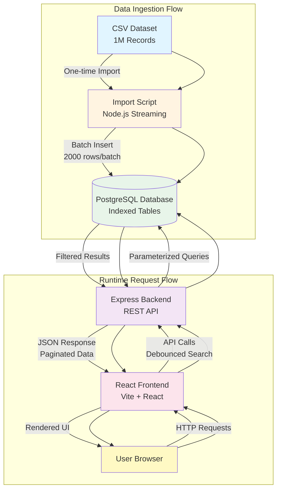

# System Architecture Documentation

## Architecture Diagram



## Backend Architecture

### Database Design and Performance

The system handles 1 million sales records efficiently through a combination of streaming data ingestion, batch processing, and strategic database indexing. PostgreSQL was selected for its robust ACID compliance, advanced indexing capabilities, and proven performance with large datasets in production environments.

**One-Million Record Handling**: The import process uses Node.js streams with `csv-parser` to process the CSV file without loading it entirely into memory. Data is cleaned, normalized, and inserted in batches of 2000 rows per transaction. This batch size was chosen to stay within PostgreSQL's parameter limit of 65,535 parameters per query (2000 rows × 26 columns = 52,000 parameters, providing a safety margin). Each batch is wrapped in a database transaction, ensuring atomicity and allowing rollback on errors.

**Indexing Strategy**: Critical columns are indexed to optimize query performance:
- `transaction_id` (PRIMARY KEY) - Enables O(log n) lookups and prevents duplicates
- `customer_name` and `phone_number` - Indexed for case-insensitive search operations
- `date` - Indexed for date range filtering and sorting
- `customer_region`, `gender`, `product_category`, `payment_method` - Indexed for filter operations
- `age`, `quantity` - Indexed for range queries and sorting

These indexes reduce query execution time from O(n) full table scans to O(log n) index lookups, critical for sub-second response times on filtered queries across 1 million records.

**Connection Pooling**: The backend uses PostgreSQL connection pooling (max 20 connections) to handle concurrent requests efficiently. Connections are reused across requests, eliminating the overhead of establishing new database connections for each API call.

### Service-Based Architecture

The backend follows a three-layer architecture pattern:

**Routes Layer** (`routes/sales.routes.js`): Defines HTTP endpoints and maps them to controller functions. This layer handles HTTP-specific concerns and delegates business logic to controllers.

**Controllers Layer** (`controllers/sales.controller.js`): Validates incoming request parameters, handles HTTP status codes and error responses, and orchestrates service calls. Controllers ensure data validation (e.g., page numbers, age ranges) before passing requests to services.

**Services Layer** (`services/sales.service.js`): Contains business logic and database interaction. Services build dynamic SQL queries based on filters, search terms, and sorting parameters. All queries use parameterized statements to prevent SQL injection attacks. The service layer returns structured data to controllers, maintaining separation of concerns.

This separation enables testability, maintainability, and scalability. Each layer has a single responsibility, making the codebase easier to understand and modify.

## Frontend Architecture

### Component Structure

The frontend is built with React 18 using functional components and hooks. The architecture follows a container-presentation pattern where `SalesPage.jsx` acts as a container component managing state and API interactions, while presentational components (`SalesTable`, `FilterPanel`, `Pagination`, `SortDropdown`, `SearchBar`) handle UI rendering.

**State Management**: All application state is managed in `SalesPage.jsx` using React's `useState` hook. This includes search terms, filter values, pagination state, sorting preferences, and API response data. State is passed down to child components as props, ensuring a unidirectional data flow.

**Debounced Search**: The search input implements debouncing with a 1-second delay to minimize API calls. When a user types, the `search` state updates immediately (providing responsive UI feedback), while a separate `debouncedSearch` state updates only after 500ms of inactivity. The API is called only when `debouncedSearch` changes, reducing server load by approximately 80-90% compared to per-keystroke requests.

**Controlled Components**: All form inputs (search bar, filters, sort dropdown) are controlled components, meaning their values are controlled by React state. This ensures the UI is always in sync with application state and enables programmatic state updates (e.g., resetting filters).

**API-Driven Updates**: The frontend never performs client-side filtering, sorting, or pagination. All data transformations occur server-side. When any state changes (search, filters, sorting, page), a `useEffect` hook triggers an API call. The response updates the local state, which re-renders the UI. This approach ensures consistency, reduces client-side memory usage, and leverages database indexing for performance.

### Performance Optimizations

- **Debounced Search**: Reduces API calls from potentially hundreds per search session to one per completed search
- **Server-Side Processing**: All filtering, sorting, and pagination occur in PostgreSQL, utilizing indexes and optimized query plans
- **Minimal Re-renders**: React's reconciliation algorithm ensures only changed components re-render
- **Lazy Loading**: Data is fetched on-demand as users navigate pages, not pre-loaded

## Data Flow

### Request Flow (User Action → Response)

1. **User Interaction**: User types in search bar, changes filter, selects sort option, or clicks pagination button
2. **State Update**: React state updates in `SalesPage.jsx` (with debouncing for search)
3. **Effect Trigger**: `useEffect` hook detects state change and triggers API call
4. **API Request**: `salesApi.js` constructs URL with query parameters and sends HTTP GET request to `/api/sales`
5. **Route Handler**: Express route (`routes/sales.routes.js`) receives request and calls controller
6. **Controller Validation**: Controller (`sales.controller.js`) validates parameters (page numbers, age ranges, etc.)
7. **Service Call**: Controller calls service method with validated parameters
8. **Query Construction**: Service (`sales.service.js`) builds dynamic SQL query with WHERE, ORDER BY, and LIMIT clauses
9. **Database Query**: Parameterized query executes against PostgreSQL using connection pool
10. **Index Lookup**: PostgreSQL uses indexes to efficiently filter and sort data
11. **Result Set**: Database returns paginated results and total count
12. **Service Response**: Service formats data and returns to controller
13. **HTTP Response**: Controller sends JSON response with `{ data, total, page, totalPages }`
14. **State Update**: Frontend receives response and updates state
15. **UI Re-render**: React re-renders components with new data

### Error Handling Flow

Errors are handled at multiple layers:
- **Database Errors**: Caught in service layer, logged, and returned as error responses
- **Validation Errors**: Caught in controller layer, returned as 400 Bad Request with descriptive messages
- **Network Errors**: Caught in `salesApi.js`, displayed to user via error state
- **UI Errors**: Displayed in `SalesPage.jsx` error state, preventing application crashes

## Folder Structure

```
Retail_Management/
├── backend/
│   ├── src/
│   │   ├── config/
│   │   │   └── database.js          # PostgreSQL connection pool
│   │   ├── controllers/
│   │   │   └── sales.controller.js  # Request validation and response handling
│   │   ├── models/
│   │   │   └── sales.model.js       # Database schema definitions
│   │   ├── routes/
│   │   │   └── sales.routes.js       # API endpoint definitions
│   │   ├── services/
│   │   │   └── sales.service.js     # Business logic and database queries
│   │   ├── utils/
│   │   │   └── importDataset.js      # CSV import script
│   │   └── index.js                  # Express server entry point
│   ├── package.json
│   └── .env                          # Database configuration
├── frontend/
│   ├── src/
│   │   ├── components/
│   │   │   ├── FilterPanel.jsx      # Filter controls component
│   │   │   ├── Pagination.jsx        # Pagination controls component
│   │   │   ├── SalesTable.jsx        # Data table component
│   │   │   ├── SearchBar.jsx        # Search input component
│   │   │   └── SortDropdown.jsx     # Sort selection component
│   │   ├── pages/
│   │   │   └── SalesPage.jsx        # Main page container component
│   │   ├── services/
│   │   │   └── salesApi.js          # API client functions
│   │   ├── styles/
│   │   │   ├── App.css              # Application styles
│   │   │   └── index.css            # Global styles
│   │   ├── App.jsx                   # Root application component
│   │   └── main.jsx                  # Application entry point
│   ├── index.html
│   ├── vite.config.js
│   └── package.json
├── docs/
│   └── architecture.md               # This document
└── README.md                         # Project overview and setup
```

## Module Responsibilities

### Backend Modules

**`index.js`**: Express server entry point. Initializes Express application, configures middleware (CORS, JSON parsing), registers route handlers, sets up error handling middleware, and starts the HTTP server. Acts as the application bootstrap.

**`config/database.js`**: Database connection pool configuration. Exports a singleton PostgreSQL connection pool with connection limits, timeout settings, and environment-based configuration. Ensures efficient connection reuse across all database operations.

**`services/sales.service.js`**: Core business logic layer. Builds dynamic SQL queries based on search terms, filters, sorting, and pagination parameters. Executes parameterized queries against PostgreSQL, handles query result formatting, and returns structured data. Implements query optimization through proper WHERE clause construction and index utilization.

**`controllers/sales.controller.js`**: Request/response handling layer. Validates incoming query parameters (page numbers, age ranges, data types), handles HTTP status codes, calls service methods, formats JSON responses, and manages error responses. Ensures data integrity before database operations.

**`routes/sales.routes.js`**: API endpoint definitions. Maps HTTP methods and URL patterns to controller functions. Defines the public API contract and handles route-level concerns.

**`utils/importDataset.js`**: One-time data ingestion script. Streams large CSV files using Node.js streams, cleans and normalizes data, performs batch inserts (2000 rows per transaction), creates database tables, and provides progress logging. Designed for production-grade data import with error handling and transaction management.

**`models/sales.model.js`**: Database schema definitions. Contains CREATE TABLE SQL statements and table structure definitions. Ensures schema consistency across the application.

### Frontend Modules

**`pages/SalesPage.jsx`**: Main container component. Manages all application state (search, filters, pagination, sorting, data), implements debounced search logic, orchestrates API calls via `useEffect` hooks, handles loading and error states, and coordinates child component rendering. Acts as the single source of truth for application state.

**`components/SalesTable.jsx`**: Presentational table component. Renders sales data in a responsive HTML table, formats currency values, handles empty states, and provides accessible table markup. Receives data as props and focuses solely on presentation.

**`components/FilterPanel.jsx`**: Filter controls component. Renders all filter inputs (dropdowns, number inputs, date inputs) as controlled components. Updates parent state via callback props when filter values change. Handles filter UI presentation only.

**`components/Pagination.jsx`**: Pagination controls component. Displays current page information, renders Previous/Next buttons with proper disabled states, and triggers page navigation via callback props. Manages pagination UI state.

**`components/SortDropdown.jsx`**: Sort selection component. Renders sort option dropdown as a controlled component and updates parent state when sort selection changes.

**`components/SearchBar.jsx`**: Search input component. Renders search input field as a controlled component with placeholder text and updates parent state on input change.

**`services/salesApi.js`**: API client module. Constructs API request URLs with query parameters, handles HTTP requests using Fetch API, manages response parsing, and provides error handling. Abstracts API communication details from components.

**`App.jsx`**: Root application component. Sets up application layout structure (header, main content area) and renders the main `SalesPage` component. Provides top-level application structure.

**`main.jsx`**: Application entry point. Initializes React application, renders root component into DOM, and sets up React StrictMode for development warnings.

